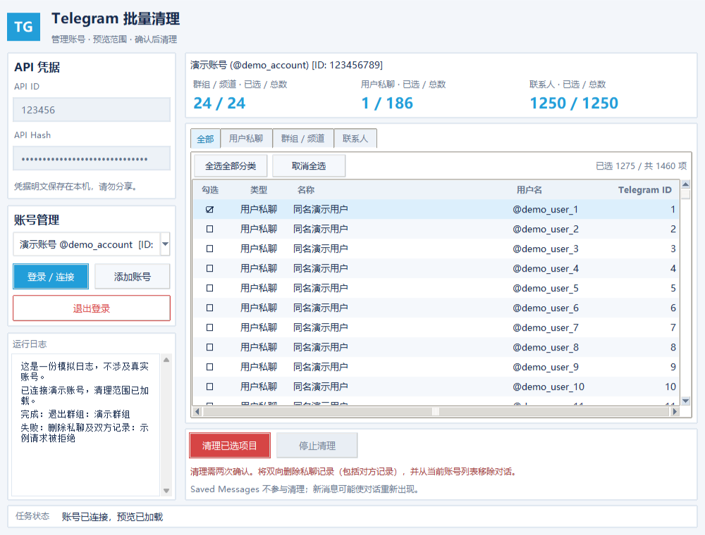
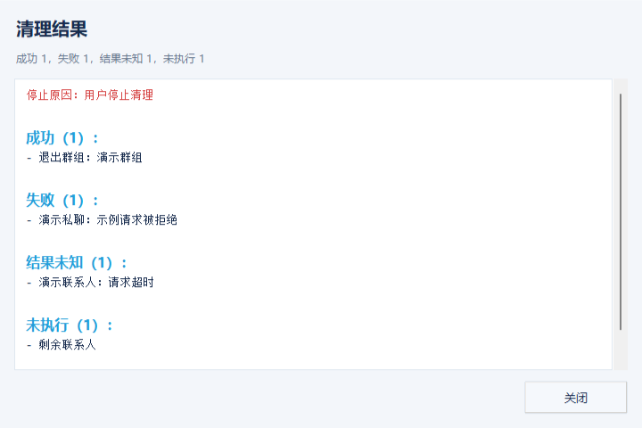

# Telegram 批量清理工具

Telegram 批量清理工具面向需要整理个人 Telegram 账号的 Windows 用户，解决逐个退出群组和频道、删除私聊及移除联系人需要重复手动操作的问题。

项目基于 Tkinter 和 Telethon，提供 Windows 图形界面，支持多账号管理、清理范围预览，以及批量退出群组/频道、双向删除私聊和移除联系人。提供“全部”汇总页，私聊、群组/频道和联系人可独立勾选、按分类全选或全部全选。

> **清理会删除对方的聊天记录，已完成的操作无法通过本工具撤销。** 执行前必须核对账号身份和预览数量，并完成两次确认。

## 软件截图

以下截图来自离线模拟界面，仅使用演示账号和模拟日志，不包含真实账号信息。

### 主界面



### 清理结果



## 安装与启动

需要 Windows、支持 Tkinter 的 Python 3.10 或更高版本，以及可访问 Telegram 的网络。当前依赖导出自 Python 3.13 环境，版本锁定在 `requirements.txt` 中。

在项目目录打开 PowerShell：

```powershell
python -m venv .venv
.\.venv\Scripts\python.exe -m pip install -r requirements.txt
```

然后双击 **start.bat**，或运行：

```powershell
.\start.bat
```

启动脚本使用 `.venv` 中的 `pythonw.exe`，不会保留终端窗口。需要查看启动异常时，使用：

```powershell
.\.venv\Scripts\python.exe tg_cleanup.py
```

程序有单实例保护，同一时间只能打开一个窗口，避免多个进程同时访问会话数据库。

## 使用方法

### 1. 获取并填写 API 凭据

打开 [Telegram API 管理页面](https://my.telegram.org)，登录后在 **API development tools** 中创建应用，取得 `API ID` 和 `API Hash`，填写到左侧输入框。

凭据以明文保存在本机 `.tg_cleanup_config.json`，请勿分享。

### 2. 添加账号

点击 **添加账号**，依次输入带国家区号的手机号、Telegram 登录验证码，以及两步验证密码（如已启用）。授权成功后会登记账号并加载清理预览；每个账号使用独立的本地会话。

登录弹窗采用分步输入：手机号可包含空格或连字符，提交时自动移除；验证码仅接受数字。空输入或格式错误会在窗口内提示，可直接修正。两步验证密码默认隐藏，可勾选 **显示密码** 查看，密码按原样提交。按 Enter 提交，按 Esc、点击 **取消** 或关闭弹窗取消登录。

重复添加同一个账号时，新建的重复登录会话会被撤销并删除。已授权账号即使预览加载失败，也会保留登记，可稍后重试连接。

### 3. 连接与切换

- 启动程序后，点击 **登录 / 连接** 连接列表中选中的账号。
- 在下拉列表选择其他账号，会自动断开原连接、连接所选账号并加载新预览。原账号的授权和本地会话保留。
- 鼠标悬停在账号列表上可查看完整账号身份。
- 只有账号已连接、预览成功加载且与列表选择一致时，才能执行清理。任务进行期间不能切换账号。

### 4. 执行批量清理

1. 核对右侧当前账号身份和三类项目数量；数量显示为 **已选 / 总数**。
2. 在右侧 **全部**、**用户私聊**、**群组 / 频道**、**联系人** 分页中选择要处理的项目，默认打开 **全部** 汇总页。加载后默认全部不勾选；点击复选列，或先选中一行再按空格切换勾选。可根据名称、用户名和 Telegram ID 核对目标。
3. 工具栏提供动态 **全选 / 取消全选** 按钮和 **反选** 按钮。当前页所有项目已勾选时按钮显示“取消全选”，未选或部分选中时显示“全选”；反选会交换当前范围内每个项目的勾选状态。**全部** 页影响三类项目，其他分类页只影响本分类。全部页显示项目类型，同一人的私聊和联系人是两条独立操作；各页勾选状态同步，工具栏显示当前页的已选数量与项目总数。私聊删除和联系人移除独立选择：仅勾选私聊不会移除联系人，仅勾选联系人不会删除私聊。
4. 点击 **清理已选项目**，核对两次确认中的账号和已选数量，阅读并完成两次确认。没有勾选项目时不能执行；任务期间不能修改选择。
5. 在左侧下方的运行日志和底部状态中查看进度、限流倒计时及错误。日志独立滚动，右侧底部的清理按钮和安全提示固定可见。
6. 完成后查看结果窗口中的成功、失败、结果未知及未执行项目。结果只统计已确认执行的项目，未勾选项目不列为“未执行”。

清理以两次确认前固定的已选预览项目为准，不在执行中扩大范围；未勾选的项目不会处理。切换账号、重新加载预览或预览失效时会清空选择。完成或停止后，继续清理需要重新连接、加载预览、重新选择并再次完成两次确认。

| 类型 | 处理方式 |
| --- | --- |
| 普通群组、超级群组、频道 | 退出 |
| 非自身用户私聊 | 删除私聊及双方历史，并从当前账号列表移除对话；包括非联系人和已注销用户 |
| 联系人 | 从联系人列表移除 |
| Saved Messages（收藏夹） | 排除，不删除 |

双向删除受 Telegram 服务端能力和权限限制。失败会明确报告，不会降级为单向清空。移除对话不会阻止再次联系，收到新消息后对话可能重新出现。

### 5. 停止与异常处理

点击 **停止清理** 会取消剩余任务并断开连接，但无法撤销已经完成的操作。关闭窗口时如有任务正在执行，也会询问是否停止并退出。

- 清理请求超过 60 秒未完成，当前项目记为 **结果未知**，停止剩余任务，不自动重发。
- 单次限流等待不超过 300 秒时显示倒计时并重试一次；等待超过 300 秒，或同一操作再次限流时停止清理。
- 停止、超时或完成后，继续清理需要重新连接、加载预览并再次完成两次确认。结果未知表示服务端可能已经执行，请先核对实际状态。

### 6. 退出登录

点击 **退出登录** 并确认，会撤销所选账号的 Telegram 登录授权、安全断开连接，随后删除本地会话及账号记录。再次添加该账号需要重新验证。

远端退出失败时保留账号和会话，提示原因并允许重试。授权已撤销但本地清理失败时，再次点击 **退出登录** 完成本地清理。退出成功后选中剩余账号，但不自动连接。

直接关闭空闲窗口仅断开连接、保留登录会话；与 **退出登录** 的行为不同。

## 本地数据与隐私

以下文件已通过 `.gitignore` 排除，不能上传或分享：

| 路径 | 内容 |
| --- | --- |
| `.tg_cleanup_config.json` | API 凭据、账号登记及选择记录 |
| `sessions/` | 各账号的 Telegram 登录会话及数据库附属文件 |
| `tg_cleanup_session.session` | 旧版本会话，启动时会尝试迁移登记 |

有效会话文件是登录凭据，持有者可能访问对应账号。请勿检查、复制、上传或公开这些文件。

## 常见问题（FAQ）

### 可以只删除部分对话吗？

可以。Telegram 批量清理工具支持在用户私聊、群组/频道和联系人三个分类中独立勾选项目，默认全部不勾选。默认打开的“全部”页汇总三类项目，并可全选全部分类；其他分类页仅全选本分类，各页勾选状态同步。点击 **清理已选项目** 并完成两次确认后，只处理已选范围。勾选私聊会删除双方历史，包括对方聊天记录，但不会同时移除联系人；联系人需要在联系人分类中另行勾选。Saved Messages（收藏夹）不参与清理。

### 删除私聊是双向的吗？

是。Telegram 批量清理工具会请求删除非自身用户私聊及双方历史，包括对方的聊天记录，并从当前账号列表移除对话。Saved Messages（收藏夹）不在清理范围内。双向删除受 Telegram 服务端能力和权限限制，失败会明确报告，不会降级为单向清空。移除对话不会阻止再次联系，收到新消息后对话可能重新出现。

### 支持 Mac / Linux 吗？

当前 Telegram 批量清理工具仅支持 Windows，不支持直接在 macOS 或 Linux 上运行。程序的单实例保护依赖 Windows API，提供的 EXE 也是 Windows 可执行文件。

### 清理操作可以撤销吗？

不能。Telegram 批量清理工具已完成的清理操作无法撤销，包括删除对方的聊天记录。点击 **停止清理** 只会取消剩余任务并断开连接，不能恢复已经处理的数据。执行前必须核对账号身份和预览数量，并完成两次确认。

### 不安装 Python 可以运行吗？

可以。Windows 用户可将已打包的 `TelegramCleanup.exe` 放入有写入权限的文件夹并双击运行，无需安装 Python。配置文件 `.tg_cleanup_config.json` 和 `sessions/` 会保存在 EXE 所在目录。分发时仅发送 EXE，不要发送自己的配置或会话文件。

### 提示“账号会话不可用”怎么办？

暂时不可读、损坏或被占用的会话会保留账号记录并禁用连接。检查文件权限和占用情况，恢复会话后重启程序。确认缺失或无授权的会话会按失效账号处理。

### 连接或加载预览超时怎么办？

检查网络是否能访问 Telegram，再点击 **登录 / 连接**。已完成授权的账号不会因预览失败而丢失登记。

### 退出登录时本地会话删除失败怎么办？

确认没有其他程序占用会话文件。程序会重试删除；如仍失败，修复占用或权限问题后再次退出登录。

### 窗口内容显示不全或文字太多怎么办？

默认窗口为 1000×760，最小为 860×640。高 DPI 或长文本超出时可滚动查看，日志和结果详情也支持独立滚动。

## 离线验证

以下检查不连接 Telegram，也不执行真实清理或退出登录：

```powershell
.\.venv\Scripts\python.exe -m py_compile tg_cleanup.py
.\.venv\Scripts\python.exe -m unittest discover -s tests -v
.\.venv\Scripts\python.exe tests/preview_ui.py
```

离线界面预览使用模拟数据，覆盖常见状态、窗口尺寸及 DPI 缩放。需要保存窗口截图时，额外安装 Pillow（仅用于截图，不是软件运行依赖）：

```powershell
.\.venv\Scripts\python.exe -m pip install Pillow
.\.venv\Scripts\python.exe tests/preview_ui.py --output-dir docs/screenshots-preview
```

真实端到端验证仅使用一次性测试账号；双向私聊删除效果应使用两个一次性账号人工确认，不应在真实账号上自动接受危险操作确认框。

## 导出依赖

使用项目虚拟环境导出运行依赖：

```powershell
.\.venv\Scripts\python.exe -m pip freeze > requirements.txt
```

如安装了 Pillow 等额外验证工具，`pip freeze` 也会导出它们；更新运行依赖清单时应使用仅安装运行依赖的环境。

## Windows EXE（无需 Python）

将 `dist/TelegramCleanup.exe` 复制到有写入权限的文件夹，双击运行，无需安装 Python。配置文件 `.tg_cleanup_config.json` 和 `sessions/` 会保存在 EXE 所在目录，升级时替换 EXE 即可。分发时仅发送 EXE，不要发送自己的配置或会话文件。

重新打包：安装 Python 后执行 `build_exe.bat`。脚本会创建独立的 `.build-venv` 环境并安装固定的应用依赖与 PyInstaller，然后生成 EXE。首次打包需要联网下载依赖。
